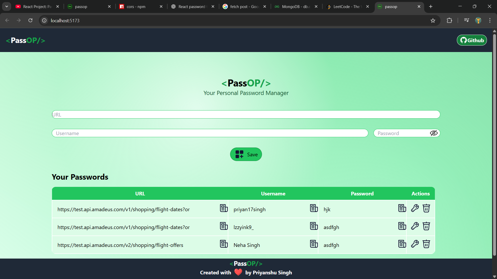

# 🔐 PassOP – Password Manager

**PassOP** is a simple and secure **password manager** built using **React.js** and **Local Storage**.  
It allows users to store, edit, and manage all their website passwords in one place — right inside the browser.  
No backend or cloud — your passwords stay safe **locally on your device**.

---

## 🚀 Demo

👉 [**Live Demo**](https://your-demo-link-here.com)

*(Replace the link above with your deployed site URL — e.g., from Netlify or Vercel.)*

---

## 📸 Preview



*(Save a screenshot of your app as `screenshot.png` in the main folder for it to appear here.)*

---

## 💡 Features

- ✅ Add, edit, and delete website credentials (URL, username, password)
- ✅ Copy passwords securely to clipboard
- ✅ Password visibility toggle (show/hide)
- ✅ Data persistence using **Local Storage**
- ✅ Responsive and minimal UI
- ✅ 100% client-side — no data leaves your computer

---

## 🛠️ Tech Stack

| Technology | Purpose |
|-------------|----------|
| **React.js** | Frontend framework |
| **CSS / TailwindCSS** | Styling |
| **Local Storage API** | Data storage |
| **React Icons** | Icons for UI |

---

## ⚙️ Installation

Follow these steps to run PassOP locally:

```bash
# Clone the repository
git clone https://github.com/priyan17singh/PassOP.git

# Navigate into the project directory
cd PassOP

# Install dependencies
npm install
npm i uuid react-toastyfy
# Run the development server
npm run dev
```

---

## 👨‍💻 Author

**Priyanshu Singh**  
GitHub: [priyan17singh](https://github.com/priyan17singh)

---

⭐ *If you like this project, consider giving it a star on GitHub!* ⭐